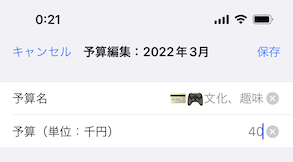
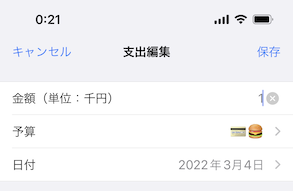

# 楽家計の使い方

簡単で、入力が少ない、使いやすい家計簿アプリ！

家計簿って、良いことだけど、使い続けるとなんか面倒になっていませんか？

簡単で、面倒にならない、そのような家計簿の書き方を考えてみました。

その為、正確さは諦めました。1,000円未満は気にしません。銅貨ではなく、**千円札**を何枚使ったかだけ考えうろことにしました。重要なのは、毎月の予算から、**何枚の千円札を使って、今何枚残っているか**です。

**予算ベース ＋ 千円札単位で管理。**

これが楽家計簿アプリです。

## 特徴

- 正確さより、**使い続けさせる**ことを重点に！
- **千円**単位で管理するので、**入力が少ない！わかりやすい！**
- 月毎**予算**を組んで、予算から引く形式で、**節約**のお助けになる

## STEP1：予算をを組む（毎月）

毎月、今月に使える予算を設定します。

- **予算名**：予算の名前です。支出画面で表示される時は**頭の2文字**のみが表示されます。絵文字とかを使っても良いでしょう。
- **予算（単位：千円）**：予算を**千円札単位**で入力します。

例えば、4万円の予算を設定する場合、予算に「**40**」を入れます。これは、この予算は「千円札40枚」だと考えば良いです。

### 固定費の予算は要りません

これは既に決まった時期に、決まった金額を支払うことが確定されたものです。あえて家計簿に記録する必要はありません。

予算ベースの家計簿では、「いくらお金が残るか」ではなく「**今月いくら使えるか？**」が重要です。

予算を組む時、固定費などを除外した残りから、「何の目的でいくら使えるか？」を考えて決めてください。

## STEP2：支出を記録する

 

予算を選択し、金額を入れます。必要な場合はメモを書きます。

金額はもちろん**千円単位**で入力します。これだけです。

### 銅貨 = ポイント、千円札のみ考えましょう

支出の基準は、**千円札を何枚使ったか？**です。

もし「100円」のものを買うとします。これを「100円」又は「500円」の銅貨で支払う場合、家計簿には記録しません。しかし、「1,000円札」で支払う場合は家計簿に「1」と記録します。

100円を1枚の千円札で支払うと「900円分」のポイントを得るんだと考えてください。

1,000円を全て銅貨で支払う場合も、家計簿に記録しません。

### クレジットカードの場合

クレジットカードの場合、銅貨の概念がない為、千円札のみで支払う場合を仮定します。

例えば「1,200円」をクレジットカードで支払う時、千円札だと2枚が要るので「2」と記録します。

「①1,200円」の後に「②1,500円」を支払う時、これが同じ予算内である場合は、①は「2」、②は「1」と記録しても良いです。

可能であれば、「現金を使う予算」と「クレジットカードで使う予算」を分けて管理した方が良いでしょう。

### Suicaなどの電子マネーの場合

お金をチャージする時のみ、家計簿に記録します。

### 固定費の場合

固定費は家計簿に記録しません。

